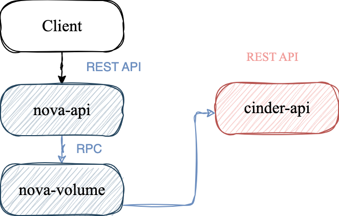
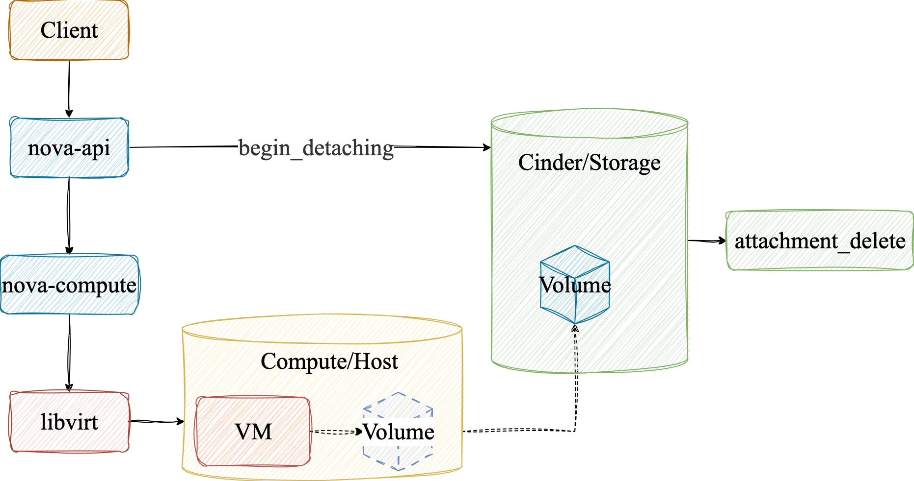

# 1. 代码结构

- 根目录

```
.
├── CONTRIBUTING.rst
├── HACKING.rst
├── LICENSE
├── MAINTAINERS
├── README.rst
├── api-guide
├── api-ref
├── bindep.txt
├── devstack
├── doc
├── etc
├── gate
├── nova
├── playbooks
├── pyproject.toml
├── releasenotes
├── requirements.txt
├── roles
├── setup.cfg
├── setup.py
├── test-requirements.txt
├── tools
└── tox.ini
```

- nova/

```bash
nova
├── __init__.py
├── accelerator
├── api # Nova的HTTP服务
├── availability_zones.py
├── baserpc.py
├── block_device.py
├── cache_utils.py
├── cmd
├── compute # Nova的计算服务
├── conductor
├── conf
├── config.py
├── console
├── context.py
├── crypto.py
├── db
├── exception.py
├── exception_wrapper.py
├── filesystem.py
├── filters.py
├── hacking
├── i18n.py
├── image
├── keymgr
├── limit
├── loadables.py
├── locale
├── manager.py
├── middleware.py
├── monkey_patch.py
├── network # Nova的网络服务
├── notifications
├── objects
├── pci
├── policies
├── policy.py
├── privsep
├── profiler.py
├── quota.py
├── rpc.py # Nova服务的远程调度库
├── safe_utils.py
├── scheduler # Nova调度器
├── service.py
├── service_auth.py
├── servicegroup
├── share
├── storage
├── test.py
├── tests # 单元测试
├── utils.py
├── version.py
├── virt
├── volume # 卷服务
├── weights.py
└── wsgi
```

# 2. Attach Volume

## 2.1 流程



## 2.2 入口

`nova.api.openstack.compute.volumes.VolumeAttachmentController.create`是`nova-api`层的入口方法。首先获取上下文`context`和实例对象`common.get_instance`，然后校验用户是否有权限挂载卷，接着获取卷的相关信息，包括`volume_id, device, tag, delete_on_termination`。核心方法是调用`self.compute_api.attach_volume`获得卷路径，获得卷挂载信息返回给客户端。

## 2.3 compute.api.API.attach_volume

`compute.api.API.attach_volume`会在`attach`进行检查，包括`device`是否合法，从`Cinder`中获取卷的信息`volume = self.volume_api.get(context, volume_id)`，确保卷没有被挂载到当前实例。如果虚拟机的状态为`vm_states.SHELVED_OFFLOADED`，说明虚拟机已经完全从`compute node`卸载了，那么就会调用`_attach_volume_shelved_offloaded`， 记录虚拟机的挂载信息，并等待虚拟机唤醒`unshelve`，再去真正的挂载卷。否则一切正常就会调用`self._attach_volume`方法。

`nova.volume.cinder.API.get`方法是`nova`访问`cinder`卷信息的接口。它的核心方法是`cinderclient(context, microversion=microversion).volumes.get(volume_id)`使用客户端发送`HTTP`请求到`cinder-api`获得卷的最新状态，然后转化为`nova`的内部格式。

`_attach_volume`第一步会通过`volume_bdm = self._create_volume_bdm`创建`BDM(Block Device Mapping)`，它是一个`nova`数据库对象，记录了卷和实例之间的映射。然后再次检查卷能否被挂载并预留卷用于挂载，在记录挂载事件开始后`_record_action_start`，远程调用`self.compute_rpcapi.attach_volume`来执行挂载卷。

`compute.rpcapi.ComputeAPI.attach_volume`异步的`RPC`调用`compute`节点上的`attach_volume`。

## 2.4 attach_volume

`compute.manager.ComputeManager.attach_volume`收到调用请求后最终执行挂载卷。首先将nova的`BlockDeviceMapping`对象转化为虚拟机管理驱动需要的格式`driver_bdm`，然后加锁保证同一个实例的`attach`操作是同步执行的`@utils.synchronized(instance.uuid)`，最后调用真正挂载函数`_attach_volume`。

`_attach_volume`首先获得管理员权限，然后发出`fields.NotificationPhase.START`开始挂载的通知，核心操作是`bdm.attach`，最后通知挂载完成`fields.NotificationPhase.END`。

`nova.virt.block_device.DriverVolumeBlockDevice.attach`还是会从`cinder-api`中获得卷信息，在锁定卷状态后，调用`self._do_attach`实现挂载。`_do_attach`在提权之后，获取虚拟化驱动连接器`connector = virt_driver.get_volume_connector(instance)`，如果卷已经在cinder注册了挂载信息那就`_volume_attach`，否则`_legacy_volume_attach`。

`_volume_attach`通过`attachment_id`和`connector`发送给`cinder-api`，cinder会返回`connection_info`，例如`RBD pool/mon`的信息，接下来的核心就是调用虚拟化驱动`virt_driver.attach_volume`，执行`hypervisor`层的挂载操作，执行完成后，保存`connection_info`到`BDM`的数据库中，在`detach`的时候会用到。最后调用cinder的`attachment_complete`，表示挂载卷完成，cinder会将卷状态改为`in-use`，如果`attachment_complete`这一步失败就会调用`detach_volume`和`attachment_delete`做回滚。

对于`libvirt`后端来说是通过`virt.libvirt.driver.LibvirtDriver.attach_volume`来实现的。首先就是获得一个实例对应的虚拟机`guest = self._host.get_guest(instance)`，然后确定挂载参数包括设备名，总线类型和磁盘类型。核心方法是`_connect_volume`将卷连接到宿主机，此时未加入到虚拟机中，在生成`libvirt`的磁盘配置，主要包括镜像元数据和总线类型，之后调用`guest.attach_device`，并且如果虚拟机正在运行的话`(power_state.RUNNING, power_state.PAUSED)`就会走热插拔`live attach`，最后更新nova的`instance`表。

对于`_connect_volume`根据入参`connection_info`的`driver_volume_type`，例如`iscsi, rbd, nfs`等，通过`self._get_volume_driver`获得对应的`vol_driver`，然后在宿主机上执行`vol_driver.connect_volume`，接着如果这个卷在cinder登机了加密信息，如加密算法，密钥ID，那么nova在连接之后，根据cinder中的加密元数据，通过`_attach_encryptor`从`barbican`获得密钥，然后在宿主机上创建一层加密映射，对于虚拟机来说是是一个普通的块设备，而对于存储后端来说这就是一个加密的数据流。最终宿主机的`/dev`会出现对应的块设备文件。


在连接成功后，`nova.virt.libvirt.guest.Guest.attach_device`将块设备挂载到虚拟机上，首先配置`persistent`和`live`参数到虚拟机定义中并转化为`libvirt`可识别的`device_xml`，最后调用`libvirt-python`中的`self._domain.attachDeviceFlags`。


# 3. Detach Volume

## 3.1 入口

和挂载卷类似，`nova.api.openstack.compute.volumes.VolumeAttachmentController.delete`是`nova-api`的入口，首先还是获取实例，同时增加了对请求者是否有权限`detach`的检查，接着获得卷和`BDM`，如果是`root`卷就会禁止卸载，最终调用`nova.compute.ai.API.detach_volume`。

## 3.2 compute.api.API.detach_volume

当实例处于`vm_states.SHELVED_OFFLOADED`状态时，实例计算资源已经被释放，实例状态和数据只保留在存储中，就会调用`self._detach_volume_shelved_offloaded`，否则正常状态就会调用`self._detach_volume`。

`nova.compute.api.API._detach_volume`首先会调用`volume.cinder.API.begin_detaching`，实际上是调用`nova`调用`cinder`，将卷的状态从`in-use`，转化为`detaching`，并记录实例的挂载信息。然后获取实例与卷的挂载信息ID`attachment_id`，同时记录`instance_actions.DETACH_VOLUME`开始挂载事件在数据库中，最后核心方法是通过`compute.rpcapi.ComputeAPI.detach_volume`方法`RPC`调用实例所在的`compute`节点执行`detach_volume`操作。

## 3.3 detach_volume

和挂载卷类似，`compute.manager.ComputeManager.detach_volume`负责卸载卷。同样，对实例加锁，防止多线程挂载卷，然后得到`bdm`，核心是调用它的子方法`compute.manager.ComputeManager._detach_volume`。

首先通知`fields.NotificationPhase.START`开始卸载卷，同时记录实例卸载卷的行为`_notify_volume_usage_detach`，用于监控或计费。在将`bdm`转化为`DriverVolumeBlockDevice`后，真正的调用`driver_bdm.detach`，断开宿主机的连接，取消挂载到实例。完成后再次通知`fields.NotificationPhase.END`删除结束，并清理卷相关的`BDM`数据和实例中的卷数据。

`virt.block_device.DriverVolumeBlockDevice.detach`是`virt`卸载卷的接口，它调用`_do_detach`，`_do_detach`对于实例在本地计算节点直接调用`self.driver_detach`首先从实例中卸载卷。然后通过`volume_api.attachment_delete`断开宿主机和卷的连接。

`driver_detach`的核心就是获取加密信息和`virt_driver.detach_volume`从虚拟机中删除卷，宿主机也解除映射，最后一步通知`cinder`该连接已经断开。

`virt.libvirt.driver.LibvirtDriver.detach_volume`的核心是首先调用`self._detach_with_retry`把卷从虚拟机内部卸载掉，然后调用`_disconnect_volume`把卷从宿主机上解除映射，和挂载卷类似最终也是是调用`vol_driver.disconnect_volume`。

`volume.cinder.API.attachment_delete`调用`cinder-api`的`attachments.delete`来删除挂载记录。


