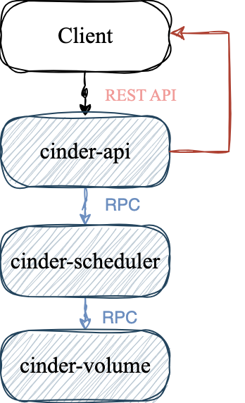
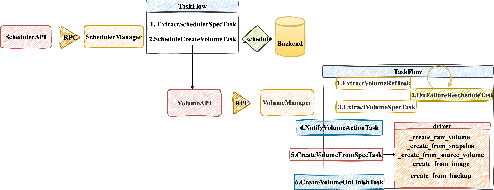
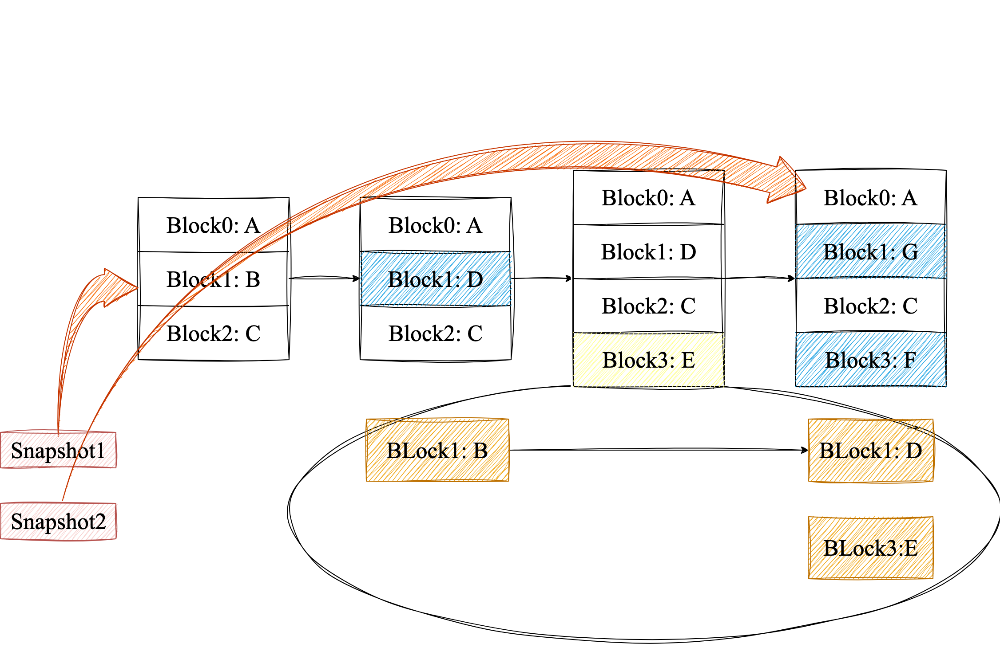

# Cinder Code Start

## 1. 入口

- 基于devstack安装

    ```sh
    sudo systemctl status "devstack@c-*
    
    ● devstack@c-api.service - Devstack devstack@c-api.service
         Loaded: loaded (/etc/systemd/system/devstack@c-api.service; enabled; preset: enabled)
    ```
    
- 查看 .service config

    ```
     ExecStart = /bin/uwsgi --procname-prefix cinder-api --ini /etc/cinder/cinder-api-uwsgi.ini --venv /opt/stack/data/venv
    ```

- 查看/etc/cinder/cinder-api-uwsgi.ini

    ```
    module = cinder.wsgi.api:application
    ```
    

## 2. 代码结构

- 根目录

```sh
.
├── api-ref 
├── bindep.txt
├── cinder # cinder核心代码，包含cinder-api,scheduler, volume manager, driver等模块
├── CONTRIBUTING.rst
├── conversion # 数据库或配置迁移工具
├── doc # 文档
├── driver-requirements.txt
├── etc
├── HACKING.rst
├── LICENSE
├── mypy-files.txt
├── playbooks
├── rally-jobs
├── README.rst
├── releasenotes
├── reno.yaml
├── requirements.txt
├── roles
├── ruff.toml
├── setup.cfg
├── setup.py
├── test-requirements.txt
├── tools
└── tox.ini
```

- cinder/

```sh
.
├── api # REST API的定义
├── backup
├── brick
├── cmd # 服务入口，cinder-api, cinder-volume
├── common
├── compute
├── context.py
├── coordination.py
├── db # 数据库访问层
├── exception.py
├── flow_utils.py
├── group
├── i18n.py
├── image
├── __init__.py
├── interface
├── keymgr
├── locale
├── manager.py
├── message
├── objects
├── opts.py
├── policies
├── policy.py
├── privsep
├── __pycache__
├── quota.py
├── quota_utils.py
├── rpc.py
├── scheduler # 调度器，决定存储后端
├── service_auth.py
├── service.py
├── ssh_utils.py
├── tests # 单元测试，使用tox
├── transfer
├── utils.py
├── version.py
├── volume # 卷管理核心
├── wsgi
└── zonemanager
```

## 3. Create Volume
### 3.1 流程



### 3.2 入口

  ``` python
  # cinder.api.v3.volume.VolumeController.create

  # 进入cinder-api层
  def create(self, req, body)

  # 封装了认证信息、project、user、权限等
  context = req.environ['cinder.context']

  # 调用Volume API
  # self.volume_api = cinder.volume.cinder_volume.API()
  try:
      new_volume = self.volume_api.create(
          context, size, volume.get('display_name'),
          volume.get('display_description'), **kwargs)
  except exception.VolumeTypeDefaultMisconfiguredError as err:
      raise exc.HTTPInternalServerError(explanation=err.msg)

  # 构建response返回给Client
  retval = self._view_builder.detail(req, new_volume)
  return retval
  ```

### 3.3 疑似的bug

```python
volume = body['volume']
kwargs = {}

self.validate_name_and_description(volume, check_length=False)
```

`validate_name_and_description`是用来检查volume的各个属性是否满足一定的条件，它调用的是：

```python
# cinder.api.openstack.wsgi

@staticmethod
def validate_name_and_description(body, check_length=True):
    for attribute in ['name', 'description',
                      'display_name', 'display_description']:
        value = body.get(attribute)
        if value is not None:
            if isinstance(value, str):
                # 疑似bug
                body[attribute] = value.strip()
            if check_length:
                try:
                    utils.check_string_length(body[attribute], attribute,
                                              min_length=0, max_length=255)
                except exception.InvalidInput as error:
                    raise webob.exc.HTTPBadRequest(explanation=error.msg)
```

核心函数在`cinder.utils`：

```python
def check_string_length(value: str, name: str, min_length: int = 0,
                    max_length: Optional[int] = None,
                    allow_all_spaces: bool = True) -> None:
try:
    # oslo_utils.strutils
    strutils.check_string_length(value, name=name,
                                 min_length=min_length,
                                 max_length=max_length)
except (ValueError, TypeError) as exc:
    raise exception.InvalidInput(reason=exc)

# 疑似bug
if not allow_all_spaces and value.isspace():
    msg = _('%(name)s cannot be all spaces.')
    raise exception.InvalidInput(reason=msg)
```


- 如果一个字符串是空格串，例如`"     "`，那么经过`value.strip`后字符串会变成`""`，长度为0，那么`value.isspace()`为`False`。

- 如果`check_length`为`Flase`那么就不会检查`value`是否为空格串了。

### 3.4 异常类的分析

```python
class CinderException(Exception):
    def __init__(self, message: Optional[Union[str, tuple]] = None, **kwargs):
        self.kwargs = kwargs
        self.kwargs['message'] = message

        if self._should_format():
            try:
                message = self.message % kwargs
            except Exception:
                self._log_exception()
                message = self.message
        elif isinstance(message, Exception):
            message = str(message)

class Invalid(CinderException):
    message = "Unacceptable parameters."
    code = 400

class InvalidInput(Invalid):
    message = "Invalid input received: %(reason)s"
```

通过`message = self.message % kwargs`得到格式化后的字符串，例如当校验数据过长时：

```zsh
"Invalid input received: %(reason)s" % {"reason": "Failed: Invalid input received: name has 4496 characters, more than 255."}
```

### 3.5 构建参数

大多数传入`self.volume_api.create`的参数通过`volume.get()`直接获取，例如`display_name`, `display_description`, `imageRef`, `metadata`, `availability_zone`, `scheduler_hints`，少部分通过**api调用**：


create volume的时候可以传入一个镜像`imageRef`，cinder-api在收到这个参数时会解析`imageRef`，获取相关镜像信息，如果`imageRef`是一个由快照创建的镜像，也就是说这个镜像是快照的一个副本，那么后续创建时就会通过`snapshot`模式会更快。


创建卷的方式有多种，在`cinder-api`层获取卷的`size`包括从`snapshot`, `source_volume`, `backup`，如果要从镜像中获取，会在实际的`cinder.volume.cinder_volume.API().create`中获取：

```python
    size = volume.get('size', None)
    if size is None and kwargs['snapshot'] is not None:
        size = kwargs['snapshot']['volume_size']
    elif size is None and kwargs['source_volume'] is not None:
        size = kwargs['source_volume']['size']
    elif size is None and kwargs.get('backup') is not None:
        size = kwargs['backup']['size']
```

### 3.6 进入`cinder.volume.cinder_volume.API().create`

实际上`cinder.api.v3.volume.VolumeController.create`属于接口层。在Cinder中每一个关键步骤都要进行权限检查：

```python
    if image_id:
        context.authorize(vol_policy.CREATE_FROM_IMAGE_POLICY)
    else:
        context.authorize(vol_policy.CREATE_POLICY)
```

通常以从`image`中创建卷的话必须要`admin`用户。接下来会进行一系列的校验：

- 卷大小的校验`volume_types.provision_filter_on_size(context, volume_type, size)`

- 指定了`consistencygroup`，同时不是通过`cgsnapshot`或者`source_cg`的方式，那么必须指定`volume_type`，同时`volume_type`必须要是当前一致组支持的卷类型。
    - **一致性组**是将多个卷放到同一个组中，可以使用**一致性快照**，**一致性克隆**， **组恢复**。例如一个数据库系统中卷A保存数据库数据，卷B存储日志，卷C存储配置，如果要对这三个卷做快照，这三个快照完成的时间可能不一致，也就导致数据不一致。

- 如果指定了源卷和卷类型，那么就会验证它们是否兼容或互相转换：
    ```python
    self._retype_is_possible(context, source_volume.volume_type, volume_type)
    ```

    - `_retype_is_possible`会首先检查两种卷类型加密方式，加密参数是否相同，不相同会导致数据无法正常读写。
    - 如果存储后端服务只有一种`objects.ServiceList.get_all_by_topic`，那么转换也是安全的。
    - 后端名称如果一致也是安全的：`cinder.volume.volume_utils.matching_backend_name`。

- 同样，对指定的快照和卷类型，也会验证它们的兼容性。

- 之后会在缓存和配置中收集可用区的信息

    ```python
    raw_zones = self.list_availability_zones(enable_cache=True)
    availability_zones = set([az['name'] for az in raw_zones])
    if CONF.storage_availability_zone:
        availability_zones.add(CONF.storage_availability_zone)
    ```

    每个后端服务都可以对应一个可用区，当我们在不同物理机上部署不同服务时，就实现了可用区的隔离。例如`Ceph`中的不同`pool`可以对应不同服务。

- `metadata`是指一组键值对，例如：

   ```json
   {
       "project": "AI",
       "env": "production",
       "owner": "foo",
       "backup": "daily"
   }
   ```

   通过`utils.check_metadata_properties(metadata)`检测键值对是否合法：`metadata`必须为一个`dict`，`key`的长度在`[1, 255]`，`value`的长度在`[0, 255]`，并且必须都为字符串。
   


接下来就会准备好调用`scheduler_rpcapi.SchedulerAPI.create_volume`的接口，并通过`flow_engine.run()`执行`task`。

```python
flow_engine = create_volume.get_flow(self.db,
                                 self.image_service,
                                 availability_zones,
                                 create_what,
                                 sched_rpcapi,
                                 volume_rpcapi)
```


- 构建一个`taskflow`对象，这个任务流是`taskflow.patterns.linear_flow.Flow`顺序执行。添加的任务包括：

| 任务 |功能 |
| :-----: | :-----: |
| `ExtractVolumeRequestTask` | 对请求的参数进行提取，处理和验证 |
| `QuotaReserveTask` | 向系统申请配额 |
| `EntryCreateTask` | 在数据库中写入新的卷记录，卷状态为`creating` |
| `QuotaCommitTask` | 锁定配额 |
| `VolumeCastTask` | 根据是否选择`scheduler`或者选择直接发RPC给`volume`后端 |

1. 第一个任务`ExtractVolumeRequestTask`。首先会限制创建卷的方式只能是`snapshot, image, source_volume, backup`四种之一，然后就会检查用户是否有创建卷的权限，提取一系列参数：`snapshot_id, source_volid, backup_id, size, consistencygroup_id, cgsnapshot_id, group_id, image_meta, image_properties`等
2. 第二个任务`QuotaReserveTask`。它主要由三部分组成`QUOTAS.limit_check`，`QUOTAS.add_volume_type_opts`和`QUOTAS.reserve`，它们分别是检查项目配额是否允许创建这个卷，给配额参数增加卷的限制，向配额系统申请预留资源。
3. 第三个任务`EntryCreateTask`，它会在数据库中插入一条`creating`的记录表示正在创建卷。首先它会处理`volume`的`bootable`属性，如果是基于已有卷或者快照创建的那么当前卷会继承它们的`bootable`属性。第二步就是组装一个`volume_properties`，其中就包括`'status': 'creating'`和其他元数据，表示正在创建卷。第三步是创建一个`objects.Volume`类，它是`ORM`类，调用`create`方法将创建卷记录写入数据库。最后再将`volume_properties`封装以便后续`RPC`传输。
4. 第四个任务`QuotaCommitTask`是正式提交配额`QUOTAS.commit(context, reservations)`，实际资源中的配额状态由`reserved`转变成`used`。
5. 最后一个任务`VolumeCastTask`从传入参数中构造参数，调用私有方法`_cast_create_volume`来实现`RPC`调用通知`scheduler`去创建卷。`_cast_create_volume`方法保证创建卷的存储后端与对应资源的存储后端一致，比如一致性组、组、快照或源卷，最后调用`self.scheduler_rpcapi.create_volume`发起`rpc`异步调用，通知`scheduler`启动创建卷。至此，第一阶段`cinder-api`的任务就完成了。

## 4. cinder-scheduler

### 4.1接口

`scheduler.rpcapi.SchedulerAPI`作为`rpc`客户端方法被调用，核心是通过`_get_cctxt`方法得到`RPC`客户端的上下文，包括消息发送到哪个节点，然后构造消息体，最后通过`cctxt.cast(ctxt, 'create_volume', **msg_args)`发送异步调用`scheduler.manager.SchedulerManager`的 `create_volume`方法。

### 4.2 创建工作流

`scheduler.manager.SchedulerManager`作为`rpc`服务端调用`scheduler.flows.get_flow`来创建并启动任务流。这个`linear_flow.Flow`包含两个任务`ExtractSchedulerSpecTask`和`ScheduleCreateVolumeTask`。

- 第一个任务`ExtractSchedulerSpecTask`根据卷的相关信息生成一个包含完整的`request_spec`的字典。
- 第二个任务`ScheduleCreateVolumeTask`的核心就是调度驱动`self.driver_api.schedule_create_volume`，它会根据`request_spec`和`filter_properties`选择存储后端并创建卷。

### 4.3 调动驱动

在`scheduler.manager.SchedulerManager`中实际的`self.driver`是`FilterScheduler`。`filter_scheduler.FilterScheduler.schedule_create_volume`的核心是调用`_schedule`选择存储后端`backend`，然后调用`scheduler.driver.volume_update_db`进行数据库中卷信息的更新，将卷的存储位置，可用区，调度时间等写入数据库。

```python
volume.host = host
volume.cluster_name = cluster_name
volume.scheduled_at = timeutils.utcnow()
volume.availability_zone = availability_zone
volume.save()
```

最后通过`RPC`调用`volume.rpcapi.VolumeAPI.create_volume`正式开始创建卷。

## 5. cinder-volume

### 5.1 接口

`volume.rpcapi.VolumeAPI.create_volume`根据卷所在的存储后端对应的消息队列名`volume.service_topic_queue`得到`PRC`客户端的上下文，然后异步调用`volume.VolumeManager.create_volume`。

### 5.2 控制卷的创建

`volume.VolumeManager.create_volume`函数首先会完成容量更新`_update_allocated_capacity`，提权`context.elevated`， 然后创建工作流，同时判断如果有相关的快照或者卷的话就加锁防止这些资源被删除，然后执行`flow_engine.run()`，最后会更新卷属性并持久化到数据库中。

### 5.3 工作流

`volume_flow`工作流包括准备`ExtractVolumeRefTask, OnFailureRescheduleTask, ExtractVolumeSpecTask, NotifyVolumeActionTask, CreateVolumeFromSpecTask, CreateVolumeOnFinishTask`。

#### 5.3.1 ExtractVolumeRefTask

刷新卷状态`volume.refresh()`，保证它存在而且是最新状态。

#### 5.3.2 OnFailureRescheduleTask

如果`taskflow`工作流出现异常时，就会逆序调用已完成任务的`revert`方法，`OnFailureRescheduleTask`的`revert`主要判断：

1. 不允许重调度。如果`self.do_reschedule`为`False`，直接将卷状态记为`error`。
2. 不适合重调度。检查`*self.no_reschedule_types`。
3. 重调度。核心是`_pre_reschedule`准备重调度，`_reschedule`重新请求调度器`scheduler.rpcapi.SchedulerAPI.create_volume`，重新挑选存储后端进行创建卷，最后调用`_post_reschedule`来收尾。

#### 5.3.3 ExtractVolumeSpecTask

这个任务将创建卷的操作统一到一个通用结构中的。无论是基于快照、源卷、镜像、备份，都转化为一个`specs`字典，并且对于有`source_volid`会直接通过`objects.Volume.get_by_id`取到源卷信息，对于有`image_id`，会直接通过`get_remote_image_service`找到`glance`中的`image_location`和`image_meta`。

#### 5.3.4 NotifyVolumeActionTask

核心是调用`volume.volume_utils.notify_about_volume_usage`通知开始创建卷的信息`NotifyVolumeActionTask(db, 'create.start')`。

#### 5.3.5 CreateVolumeFromSpecTask

它是真正调用后端驱动去创建卷的任务。根据创建卷方式的不同调用不同的方法，并更新卷的数据库记录。

##### 5.3.5.1 创建空卷`_create_raw_volume`

它首先调用`Cinder`后端驱动实例`self.driver.create_volume(volume)`，可以是`LVMDriver, Ceph RBDDriver`等。如果此时`driver`抛出异常，上层`OnFailureRescheduleTask`就会触发重调度。

##### 5.3.5.2 从快照创建`_create_from_snapshot`

1. 从数据库中找到`snapshot`对象`objects.Snapshot.get_by_id(context, snapshot_id)`，包含快照属于哪个卷、存储后端的位置、元数据、状态。

2. 调用`driver`创建卷`self.driver.create_volume_from_snapshot(volume, snapshot)`将快照克隆成一个新卷。
3. 后处理。处理`bootable`标记，如果快照来源的卷是可引导的，那么新卷也可引导。如果是可引导的，那么把`Glance`中镜像的的元数据复制到新卷，新卷也可以当作启动盘。

##### 5.3.5.3 从源卷创建`_create_from_source_volume`

调用`self.driver.create_cloned_volume`进行源卷克隆，并且如果新卷有加密密钥`encryption_key_id`，那么首先更新卷`volume.update(model_update)`，然后再执行加密`_rekey_volume`，然后再合并到`model_update`中。最后还是和从快照创建一样的后处理。

##### 5.3.5.4 从镜像创建`_create_from_image`

1. 首先从镜像元数据中取出虚拟镜像大小`virtual_size = image_meta.get('virtual_size')`并校验大小是否合理。
2. 对未加密的卷直接克隆`self.driver.clone_image`，如果没克隆成功并且可以使用URL方式则`_clone_image_volume`尝试支持`URL`协议的后端来克隆。如果仍未克隆成功则使用镜像缓存来克隆`_prepare_image_cache_entry`。若以上都未成功，那直接下载镜像写入卷`_create_from_image_cache_or_download`
3. 后处理。
4. 对于未加密卷尝试更高效的创建卷的方式，加密卷只能使用直接下载镜像来写入。

##### 5.3.5.5 从备份创建`_create_from_backup`

1. 和从快照创建类似，先获取`backup`对象。
2. 调用`self.driver.create_volume_from_backup`后端驱动，从备份创建卷。
3. 如果后端没有实现从备份创建卷`NotImplementedError`，先用`_create_raw_volume`创建一个空卷，通过`backupapi.get_available_backup_service_host`获得一个可用的备份服务节点，并修改备份状态为`fields.BackupStatus.RESTORING`，保存备份信息，最后调用备份服务的`backuprpcapi.restore_backup`异步完成数据恢复。

#### 5.3.6 CreateVolumeOnFinishTask

更新卷的状态`new_status = self.status_translation.get(volume_spec.get('status''available'))`并保存到数据库中。然后调用父类`CreateVolumeOnFinishTask`的`execute`方法通知创建卷完成`create.end`。



### 6. RBDDriver

`cinder-volume`最后调用的是配置中对应后端的`api`，对于`ceph`后端就是`volume.drivers.rbd.RBDDriver`。

#### 6.1 create_volume

`volume.drivers.rbd.RBDDriver.create_volume`的核心是通过`RADOSClient(self)`拿到连接`Ceph`集群的客户端，从而获取`client.ioctx`，它指向`Ceph`中的某个`pool`，最后通过调用`self.RBDProxy().create`调用`librbd`的`create`方法，在指定`pool`中创建一个`RBD Image`。

`self.RBDProxy()`返回了一个异步包装后的`RBD`对象`tpool.Proxy(self.rbd.RBD())`，实际上就是`python-rbd`中的管理`RBD image`的`RBD`类，而`python-rbd`就调用了`librbd C API rbd_create()`。

#### 6.2 create_volume_from_snapshot

核心是调用`_clone`方法创建基于快照的克隆卷，然后如果设置了`use_quota`并在配置中启用了`flatten`就会调用`_flatten`方法，最后如果进行根据新卷是否加密计算不同的`new_size`进行扩容`_resize`。

`_clone`方法首先获取指向快照所在的`src_pool`的客户端`RADOSClient(self, src_pool)`， 接着调用`_get_stripe_unit()`获取源`src_image`的`strip_unit`大小，实际上就是`Ceph`中`object`的大小，并获得$order = \log_2 stripe\_unit$ 。然后连接默认`pool`的客户端`dest_client`，最后调用`RBD.clone`实现跨池克隆。

`_flatten`是一个调度接口，它调用了`_do_flatten`，`_do_flatten`内部真正的调用了`RBD.flatten`。`RBD`中的快照克隆是基于`COW (Copy-On-Write)`实现的，克隆卷会依赖源快照，具体来说它引用了原快照的数据块，如果源快照被删除那么新卷数据有可能会丢失。而`flatten`会把所有的数据复制，变成完全独立存储的数据。



