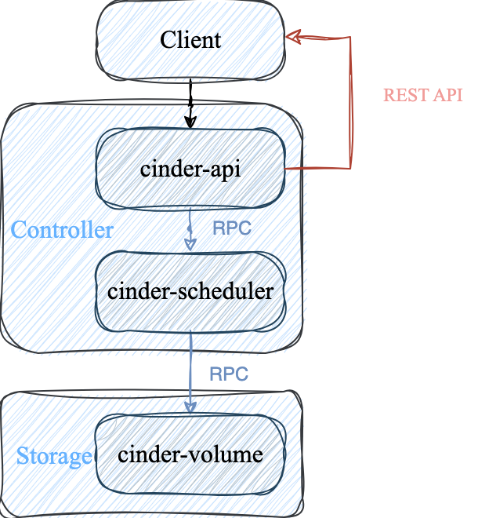

# Cinder Code Start

## 1. 入口

- 查看服务

    ```bash
    sudo systemctl status openstack-cinder-api
    
    ● openstack-cinder-api.service - OpenStack Cinder API Server
       Loaded: loaded (/usr/lib/systemd/system/openstack-cinder-api.service; enabled; vendor preset: disabled)
    ```
    
- 查看 .service

    ```
    ExecStart=/usr/bin/cinder-api --config-file /usr/share/cinder/cinder-dist.conf --config-file /etc/cinder/cinder.conf --logfile /var/log/cinder/api.log
    ```

- 查看/usr/bin/cinder-api

    ```python
    from cinder.cmd.api import main
    
    if __name__ == "__main__":
        sys.exit(main())
    ```
    

## 2. 代码结构

- 根目录

```sh
.
├── api-ref 
├── bindep.txt
├── cinder # cinder核心代码，包含cinder-api,scheduler, volume manager, driver等模块
├── CONTRIBUTING.rst
├── conversion # 数据库或配置迁移工具
├── doc # 文档
├── driver-requirements.txt
├── etc
├── HACKING.rst
├── LICENSE
├── mypy-files.txt
├── playbooks
├── rally-jobs
├── README.rst
├── releasenotes
├── reno.yaml
├── requirements.txt
├── roles
├── ruff.toml
├── setup.cfg
├── setup.py
├── test-requirements.txt
├── tools
└── tox.ini
```

- cinder/

```sh
.
├── api # REST API的定义
├── backup
├── brick
├── cmd # 服务入口，cinder-api, cinder-volume
├── common
├── compute
├── context.py
├── coordination.py
├── db # 数据库访问层
├── exception.py
├── flow_utils.py
├── group
├── i18n.py
├── image
├── __init__.py
├── interface
├── keymgr
├── locale
├── manager.py
├── message
├── objects
├── opts.py
├── policies
├── policy.py
├── privsep
├── __pycache__
├── quota.py
├── quota_utils.py
├── rpc.py
├── scheduler # 调度器，决定存储后端
├── service_auth.py
├── service.py
├── ssh_utils.py
├── tests # 单元测试，使用tox
├── transfer
├── utils.py
├── version.py
├── volume # 卷管理核心
├── wsgi
└── zonemanager
```

## 3. Create Volume
### 3.1 流程



### 3.2 入口

  ``` python
  # cinder.api.v3.volume.VolumeController.create

  # 进入cinder-api层
  def create(self, req, body)

  # 封装了认证信息、project、user、权限等
  context = req.environ['cinder.context']

  # 调用Volume API
  # self.volume_api = cinder.volume.cinder_volume.API()
  try:
      new_volume = self.volume_api.create(
          context, size, volume.get('display_name'),
          volume.get('display_description'), **kwargs)
  except exception.VolumeTypeDefaultMisconfiguredError as err:
      raise exc.HTTPInternalServerError(explanation=err.msg)

  # 构建response返回给Client
  retval = self._view_builder.detail(req, new_volume)
  return retval
  ```

### 3.3 疑似的bug

```python
volume = body['volume']
kwargs = {}

self.validate_name_and_description(volume, check_length=False)
```

`validate_name_and_description`是用来检查volume的各个属性是否满足一定的条件，它调用的是：

```python
# cinder.api.openstack.wsgi

@staticmethod
def validate_name_and_description(body, check_length=True):
    for attribute in ['name', 'description',
                      'display_name', 'display_description']:
        value = body.get(attribute)
        if value is not None:
            if isinstance(value, str):
                # 疑似bug
                body[attribute] = value.strip()
            if check_length:
                try:
                    utils.check_string_length(body[attribute], attribute,
                                              min_length=0, max_length=255)
                except exception.InvalidInput as error:
                    raise webob.exc.HTTPBadRequest(explanation=error.msg)
```

核心函数在`cinder.utils`：

```python
def check_string_length(value: str, name: str, min_length: int = 0,
                    max_length: Optional[int] = None,
                    allow_all_spaces: bool = True) -> None:
try:
    # oslo_utils.strutils
    strutils.check_string_length(value, name=name,
                                 min_length=min_length,
                                 max_length=max_length)
except (ValueError, TypeError) as exc:
    raise exception.InvalidInput(reason=exc)

# 疑似bug
if not allow_all_spaces and value.isspace():
    msg = _('%(name)s cannot be all spaces.')
    raise exception.InvalidInput(reason=msg)
```


- 如果一个字符串是空格串，例如`"     "`，那么经过`value.strip`后字符串会变成`""`，长度为0，那么`value.isspace()`为`False`。

- 如果`check_length`为`Flase`那么就不会检查`value`是否为空格串了。

### 3.4 异常类的分析

```python
class CinderException(Exception):
    def __init__(self, message: Optional[Union[str, tuple]] = None, **kwargs):
        self.kwargs = kwargs
        self.kwargs['message'] = message

        if self._should_format():
            try:
                message = self.message % kwargs
            except Exception:
                self._log_exception()
                message = self.message
        elif isinstance(message, Exception):
            message = str(message)

class Invalid(CinderException):
    message = "Unacceptable parameters."
    code = 400

class InvalidInput(Invalid):
    message = "Invalid input received: %(reason)s"
```

通过`message = self.message % kwargs`得到格式化后的字符串，例如当校验数据过长时：

```zsh
"Invalid input received: %(reason)s" % {"reason": "Failed: Invalid input received: name has 4496 characters, more than 255."}
```

### 3.5 构建参数

大多数传入`self.volume_api.create`的参数通过`volume.get()`直接获取，例如`display_name`, `display_description`, `imageRef`, `metadata`, `availability_zone`, `scheduler_hints`，少部分通过**api调用**：


create volume的时候可以传入一个镜像`imageRef`，cinder-api在收到这个参数时会解析`imageRef`，获取相关镜像信息，如果`imageRef`是一个由快照创建的镜像，也就是说这个镜像是快照的一个副本，那么后续创建时就会通过`snapshot`模式会更快。


创建卷的方式有多种，在`cinder-api`层获取卷的`size`包括从`snapshot`, `source_volume`, `backup`，如果要从镜像中获取，会在实际的`cinder.volume.cinder_volume.API().create`中获取：

```python
    size = volume.get('size', None)
    if size is None and kwargs['snapshot'] is not None:
        size = kwargs['snapshot']['volume_size']
    elif size is None and kwargs['source_volume'] is not None:
        size = kwargs['source_volume']['size']
    elif size is None and kwargs.get('backup') is not None:
        size = kwargs['backup']['size']
```

### 3.6 进入`cinder.volume.cinder_volume.API().create`

实际上`cinder.api.v3.volume.VolumeController.create`属于接口层。在Cinder中每一个关键步骤都要进行权限检查：

```python
    if image_id:
        context.authorize(vol_policy.CREATE_FROM_IMAGE_POLICY)
    else:
        context.authorize(vol_policy.CREATE_POLICY)
```

通常以从`image`中创建卷的话必须要`admin`用户。接下来会进行一系列的校验：

- 卷大小的校验`volume_types.provision_filter_on_size(context, volume_type, size)`

- 指定了`consistencygroup`，同时不是通过`cgsnapshot`或者`source_cg`的方式，那么必须指定`volume_type`，同时`volume_type`必须要是当前一致组支持的卷类型。
    - **一致性组**是将多个卷放到同一个组中，可以使用**一致性快照**，**一致性克隆**， **组恢复**。例如一个数据库系统中卷A保存数据库数据，卷B存储日志，卷C存储配置，如果要对这三个卷做快照，这三个快照完成的时间可能不一致，也就导致数据不一致。

- 如果指定了源卷和卷类型，那么就会验证它们是否兼容或互相转换：
    ```python
    self._retype_is_possible(context, source_volume.volume_type, volume_type)
    ```

    - `_retype_is_possible`会首先检查两种卷类型加密方式，加密参数是否相同，不相同会导致数据无法正常读写。
    - 如果存储后端服务只有一种`objects.ServiceList.get_all_by_topic`，那么转换也是安全的。
    - 后端名称如果一致也是安全的：`cinder.volume.volume_utils.matching_backend_name`。

- 同样，对指定的快照和卷类型，也会验证它们的兼容性。

- 之后会在缓存和配置中收集可用区的信息

    ```python
    raw_zones = self.list_availability_zones(enable_cache=True)
    availability_zones = set([az['name'] for az in raw_zones])
    if CONF.storage_availability_zone:
        availability_zones.add(CONF.storage_availability_zone)
    ```

    每个后端服务都可以对应一个可用区，当我们在不同物理机上部署不同服务时，就实现了可用区的隔离。例如`Ceph`中的不同`pool`可以对应不同服务。

- `metadata`是指一组键值对，例如：

   ```json
   {
       "project": "AI",
       "env": "production",
       "owner": "foo",
       "backup": "daily"
   }
   ```

   通过`utils.check_metadata_properties(metadata)`检测键值对是否合法：`metadata`必须为一个`dict`，`key`的长度在`[1, 255]`，`value`的长度在`[0, 255]`，并且必须都为字符串。
   


接下来就会准备好调用`scheduler_rpcapi.SchedulerAPI.create_volume`的接口，并通过`flow_engine.run()`执行`task`。

```python
flow_engine = create_volume.get_flow(self.db,
                                 self.image_service,
                                 availability_zones,
                                 create_what,
                                 sched_rpcapi,
                                 volume_rpcapi)
```


- 构建一个`taskflow`对象，这个任务流是`taskflow.patterns.linear_flow.Flow`顺序执行。添加的任务包括：

| 任务 |功能 |
| :-----: | :-----: |
| `ExtractVolumeRequestTask` | 对请求的参数进行提取，处理和验证 |
| `QuotaReserveTask` | 向系统申请配额 |
| `EntryCreateTask` | 在数据库中写入新的卷记录，卷状态为`creating` |
| `QuotaCommitTask` | 锁定配额 |
| `VolumeCastTask` | 根据是否选择`scheduler`或者选择直接发RPC给`volume`后端 |

1. 第一个任务`ExtractVolumeRequestTask`。首先会限制创建卷的方式只能是`snapshot, image, source_volume, backup`四种之一，然后就会检查用户是否有创建卷的权限，提取一系列参数：`snapshot_id, source_volid, backup_id, size, consistencygroup_id, cgsnapshot_id, group_id, image_meta, image_properties`等
2. 第二个任务`QuotaReserveTask`。它主要由三部分组成`QUOTAS.limit_check`，`QUOTAS.add_volume_type_opts`和`QUOTAS.reserve`，它们分别是检查项目配额是否允许创建这个卷，给配额参数增加卷的限制，向配额系统申请预留资源。
3. 第三个任务`EntryCreateTask`，它会在数据库中插入一条`creating`的记录表示正在创建卷。首先它会处理`volume`的`bootable`属性，如果是基于已有卷或者快照创建的那么当前卷会继承它们的`bootable`属性。第二步就是组装一个`volume_properties`，其中就包括`'status': 'creating'`和其他元数据，表示正在创建卷。第三步是创建一个`objects.Volume`类，它是`ORM`类，调用`create`方法将创建卷记录写入数据库。最后再将`volume_properties`封装以便后续`RPC`传输。
4. 第四个任务`QuotaCommitTask`是正式提交配额`QUOTAS.commit(context, reservations)`，实际资源中的配额状态由`reserved`转变成`used`。
5. 最后一个任务`VolumeCastTask`从传入参数中构造参数，调用私有方法`_cast_create_volume`来实现`RPC`调用通知`scheduler`去创建卷。`_cast_create_volume`方法保证创建卷的存储后端与对应资源的存储后端一致，比如一致性组、组、快照或源卷，最后调用`self.scheduler_rpcapi.create_volume`发起`rpc`异步调用，通知`scheduler`启动创建卷。至此，第一阶段`cinder-api`的任务就完成了。

## 4. cinder-scheduler

### 4.1接口

`scheduler.rpcapi.SchedulerAPI`作为`rpc`客户端方法被调用，核心是通过`_get_cctxt`方法得到`RPC`客户端的上下文，包括消息发送到哪个节点，然后构造消息体，最后通过`cctxt.cast(ctxt, 'create_volume', **msg_args)`发送异步调用`scheduler.manager.SchedulerManager`的 `create_volume`方法。

### 4.2 创建工作流

`scheduler.manager.SchedulerManager`作为`rpc`服务端调用`scheduler.flows.get_flow`来创建并启动任务流。这个`linear_flow.Flow`包含两个任务`ExtractSchedulerSpecTask`和`ScheduleCreateVolumeTask`。

- 第一个任务`ExtractSchedulerSpecTask`根据卷的相关信息生成一个包含完整的`request_spec`的字典。
- 第二个任务`ScheduleCreateVolumeTask`的核心就是调度驱动`self.driver_api.schedule_create_volume`，它会根据`request_spec`和`filter_properties`选择存储后端并创建卷。

### 4.3 调动驱动

在`scheduler.manager.SchedulerManager`中实际的`self.driver`是`FilterScheduler`。`filter_scheduler.FilterScheduler.schedule_create_volume`的核心是调用`_schedule`选择存储后端`backend`，然后调用`scheduler.driver.volume_update_db`进行数据库中卷信息的更新，将卷的存储位置，可用区，调度时间等写入数据库。

```python
volume.host = host
volume.cluster_name = cluster_name
volume.scheduled_at = timeutils.utcnow()
volume.availability_zone = availability_zone
volume.save()
```

最后通过`RPC`调用`volume.rpcapi.VolumeAPI.create_volume`正式开始创建卷。

## 5. cinder-volume

### 5.1 接口

`volume.rpcapi.VolumeAPI.create_volume`根据卷所在的存储后端对应的消息队列名`volume.service_topic_queue`得到`PRC`客户端的上下文，然后异步调用`volume.VolumeManager.create_volume`。

### 5.2 控制卷的创建

`volume.VolumeManager.create_volume`函数首先会完成容量更新`_update_allocated_capacity`，提权`context.elevated`， 然后创建工作流，同时判断如果有相关的快照或者卷的话就加锁防止这些资源被删除，然后执行`flow_engine.run()`，最后会更新卷属性并持久化到数据库中。

### 5.3 工作流

`volume_flow`工作流包括准备`ExtractVolumeRefTask, OnFailureRescheduleTask, ExtractVolumeSpecTask, NotifyVolumeActionTask, CreateVolumeFromSpecTask, CreateVolumeOnFinishTask`。

#### 5.3.1 ExtractVolumeRefTask

刷新卷状态`volume.refresh()`，保证它存在而且是最新状态。

#### 5.3.2 OnFailureRescheduleTask

如果`taskflow`工作流出现异常时，就会逆序调用已完成任务的`revert`方法，`OnFailureRescheduleTask`的`revert`主要判断：

1. 不允许重调度。如果`self.do_reschedule`为`False`，直接将卷状态记为`error`。
2. 不适合重调度。检查`*self.no_reschedule_types`。
3. 重调度。核心是`_pre_reschedule`准备重调度，`_reschedule`重新请求调度器`scheduler.rpcapi.SchedulerAPI.create_volume`，重新挑选存储后端进行创建卷，最后调用`_post_reschedule`来收尾。

#### 5.3.3 ExtractVolumeSpecTask

这个任务将创建卷的操作统一到一个通用结构中的。无论是基于快照、源卷、镜像、备份，都转化为一个`specs`字典，并且对于有`source_volid`会直接通过`objects.Volume.get_by_id`取到源卷信息，对于有`image_id`，会直接通过`get_remote_image_service`找到`glance`中的`image_location`和`image_meta`。

#### 5.3.4 NotifyVolumeActionTask

核心是调用`volume.volume_utils.notify_about_volume_usage`通知开始创建卷的信息`NotifyVolumeActionTask(db, 'create.start')`。

#### 5.3.5 CreateVolumeFromSpecTask

它是真正调用后端驱动去创建卷的任务。根据创建卷方式的不同调用不同的方法，并更新卷的数据库记录。

##### 5.3.5.1 创建空卷`_create_raw_volume`

它首先调用`Cinder`后端驱动实例`self.driver.create_volume(volume)`，可以是`LVMDriver, Ceph RBDDriver`等。如果此时`driver`抛出异常，上层`OnFailureRescheduleTask`就会触发重调度。

##### 5.3.5.2 从快照创建`_create_from_snapshot`

1. 从数据库中找到`snapshot`对象`objects.Snapshot.get_by_id(context, snapshot_id)`，包含快照属于哪个卷、存储后端的位置、元数据、状态。

2. 调用`driver`创建卷`self.driver.create_volume_from_snapshot(volume, snapshot)`将快照克隆成一个新卷。
3. 后处理。处理`bootable`标记，如果快照来源的卷是可引导的，那么新卷也可引导。如果是可引导的，那么把`Glance`中镜像的的元数据复制到新卷，新卷也可以当作启动盘。

##### 5.3.5.3 从源卷创建`_create_from_source_volume`

调用`self.driver.create_cloned_volume`进行源卷克隆，并且如果新卷有加密密钥`encryption_key_id`，那么首先更新卷`volume.update(model_update)`，然后再执行加密`_rekey_volume`，然后再合并到`model_update`中。最后还是和从快照创建一样的后处理。

##### 5.3.5.4 从镜像创建`_create_from_image`

1. 首先从镜像元数据中取出虚拟镜像大小`virtual_size = image_meta.get('virtual_size')`并校验大小是否合理。
2. 对未加密的卷直接克隆`self.driver.clone_image`，如果没克隆成功并且可以使用URL方式则`_clone_image_volume`尝试支持`URL`协议的后端来克隆。如果仍未克隆成功则使用镜像缓存来克隆`_prepare_image_cache_entry`。若以上都未成功，那直接下载镜像写入卷`_create_from_image_cache_or_download`
3. 后处理。
4. 对于未加密卷尝试更高效的创建卷的方式，加密卷只能使用直接下载镜像来写入。

##### 5.3.5.5 从备份创建`_create_from_backup`

1. 和从快照创建类似，先获取`backup`对象。
2. 调用`self.driver.create_volume_from_backup`后端驱动，从备份创建卷。
3. 如果后端没有实现从备份创建卷`NotImplementedError`，先用`_create_raw_volume`创建一个空卷，通过`backupapi.get_available_backup_service_host`获得一个可用的备份服务节点，并修改备份状态为`fields.BackupStatus.RESTORING`，保存备份信息，最后调用备份服务的`backuprpcapi.restore_backup`异步完成数据恢复。

#### 5.3.6 CreateVolumeOnFinishTask

更新卷的状态`new_status = self.status_translation.get(volume_spec.get('status''available'))`并保存到数据库中。然后调用父类`CreateVolumeOnFinishTask`的`execute`方法通知创建卷完成`create.end`。


## 6. RBDDriver

`cinder-volume`最后调用的是配置中对应后端的`api`，对于`ceph`后端就是`volume.drivers.rbd.RBDDriver`。

### 6.1 create_volume

`volume.drivers.rbd.RBDDriver.create_volume`的核心是通过`RADOSClient(self)`拿到连接`Ceph`集群的客户端，即`librados`的客户端，从而获取`client.ioctx`，它指向`Ceph`中的某个`pool`，最后通过调用`self.RBDProxy().create`调用`librbd`的`create`方法，在指定`pool`中创建一个`RBD Image`。

`self.RBDProxy()`返回了一个异步包装后的`RBD`对象`tpool.Proxy(self.rbd.RBD())`，实际上就是`python-rbd`中的管理`RBD image`的`RBD`类，而`python-rbd`就调用了`librbd C API rbd_create()`。

### 6.2 create_volume_from_snapshot

核心是调用`_clone`方法创建基于快照的克隆卷，然后如果设置了`use_quota`并在配置中启用了`flatten`就会调用`_flatten`方法，最后如果进行根据新卷是否加密计算不同的`new_size`进行扩容`_resize`。

`_clone`方法首先获取指向快照所在的`src_pool`的客户端`RADOSClient(self, src_pool)`， 接着调用`_get_stripe_unit()`获取源`src_image`的`strip_unit`大小，实际上就是`Ceph`中`object`的大小，并获得$order = \log_2 stripe\_unit$ 。然后连接默认`pool`的客户端`dest_client`，最后调用`RBD.clone`实现跨池克隆。

`_flatten`是一个调度接口，它调用了`_do_flatten`，`_do_flatten`内部真正的调用了`RBD.flatten`。`RBD`中的快照克隆是基于`COW (Copy-On-Write)`实现的，克隆卷会依赖源快照，具体来说它引用了原快照的数据块，如果源快照被删除那么新卷数据有可能会丢失。而`flatten`会把所有的数据复制，变成完全独立存储的数据。


### 6.3 create_cloned_volume

基于源卷`src_vref`创建出新卷。如果不允许使用克隆链，那么直接调用`Image.copy`复制完整数据，花费更多时间和空间。默认使用克隆链，首先通过`RADOSClient`来获取得到`ceph`集群连接和`ioctx`，然后通过`self.rbd.Image`也就是`RBD.Image`得到源卷`src_volume`，然后给源卷创建一个快照`src_volume.create_snap(clone_snap)`，同时保护快照`src_volume.protect_snap(clone_snap)`，最后调用`self.RBDProxy().clone`将源卷的快照克隆成一个新的卷到目标卷，这个克隆操作是`COW`的。克隆完成后，再删除临时快照。


### 6.4 clone_image

首先会解析`Glance`镜像中的多个后端的`URL`，对每个支持克隆的`url_location`提取出对应的`pool, image, snapshot`，然后调用`self._clone`基于快照进行克隆卷。

### 6.5 从备份创建卷

`librbd`没有从备份创建卷的接口，备份由`cinder-backup`实现，通过创建空卷然后写入数据实现的。

## 7. Create Snapshot

创建快照的流程和创建卷类似都是由`client -> cinder-api -> cinder-scheduler -> cinder-volume`。

### 7.1 入口

`cinder.api.v3.snapshots.SnapshotsController.create`函数接收来自`client`的请求并验证请求参数。

1. 首先取到本次请求的上下文`context = req.environ['cinder.context']`，包含权限以及认证等。
2. 取快照的信息，包括元数据`snapshot.get('metadata', None)`， 关联卷`volume_id = snapshot['volume_id']`，然后通过`self.volume_api.get(context, volume_id)`取到该卷对象。
3. 如果强制创建快照`force_flag = snapshot.get('force')`， 默认是`False`，调用`self.volume_api.create_snapshot_force`，否则正常创建快照`self.volume_api.create_snapshot`。
4. 将新创建的快照`new_snapshot`缓存到数据库，以便后续使用。最后返回快照视图`self._view_builder.detail(req, new_snapshot)`给客户端。

### 7.2 volume.api.API.create_snapshot

`create_snapshot_force`和`create_snapshot`核心都是调用`_create_snapshot`，强制快照创建会忽略当前卷的状态，不管卷是否在用，而`create_snapshot`会根据如果`allow_in_use=False`，卷正在使用就会拒绝创建快照。

`_create_snapshot`首先会断言判断卷是否被冻结`volume.assert_not_frozen()`，然后会创建快照的数据库记录`create_snapshot_in_db`同时会做很多逻辑检查，包括卷是否允许创建快照、卷状态是否合法、卷组操作等。最后核心是调用`self.scheduler_rpcapi.create_snapshot`给`scheduler`通知创建数据库。

### 7.3 cinder-scheduler

#### 7.3.1 接口

`scheduler.rpcapi.SchedulerAPI.create_snapshot`负责发起`RPC`请求。首先通过`rpc.RPCAPI._get_cctxt()`获取`RPC`客户端上下文，`scheduler.rpcapi.SchedulerAPI`继承了`rpc.RPCAPI`，并设置了`TOPIC = constants.SCHEDULER_TOPIC`，最后通过这个上下文`cctxt`向`sceduler`的消息队列发起`create_snapshot`的调用请求。

#### 7.3.2 调度

`scheduler.manager.SchedulerManager.create_snapshot`接收到请求后，首先等待调度器是否就绪`self._wait_for_scheduler()`，然后验证存储后端是否满足过滤条件`tgt_backend = self.driver.backend_passes_filters`，并对该后端资源预占用`tgt_backend.consume_from_volume`，成功后调用`volume.rpcapi.VolumeAPI.create_snapshot`准备`RPC`调用。

### 7.4 cinder-volume

#### 7.4.1 接口

调度器调度结束后，通过`volume.rpcapi.VolumeAPI.create_snapshot`进行`RPC`调用`volume`的后端服务`create_snapshot`。同样的，`VolumeAPI(rpc.RPCAPI)`的`TOPIC = constants.VOLUME_TOPIC`。

#### 7.4.2 创建快照

`volume.manager.VolumeManager.create_snapshot`接收到调用请求，提权并通知开始创建快照`self._notify_about_snapshot_usage(context, snapshot, "create.start")`。创建快照的核心是检查驱动是否初始化成功

`volume_utils.require_driver_initialized(self.driver)`，调用存储后端驱动的`self.driver.create_snapshot`。和创建卷类似，最后更新数据库，镜像元数据同步，状态切换并发出通知`self._notify_about_snapshot_usage(context, snapshot, "create.end")`。

### 7.5. RBDDriver

通过`RBDVolumeProxy(self, snapshot.volume_name)`得到卷的操作句柄，调用`RBD.Image`的`create_snap`和`protect_snap`创建快照并防止快照被误删除。相对从源卷创建卷，`volume.drivers.rbd.RBDDriver.create_snapshot`更加简单，不需要管理快照的生命周期。

## 8. Create Backup

### 8.1. 入口

创建备份的`Rest API`入口在`cinder.api.contrib.backups.BackupsController.create`函数。首先接受，解析`HTTP`请求的参数，包括备份存储的容器`container`，要备份的卷`volume_id`，以及备份模式是否是增量备份`incremental`，是否强制备份`force`，默认都是`False`。元数据`metadata`和可用区`availability_zone`，最后调用`self.backup_api.create`，然后直接异步返回响应体`self._view_builder.summary`给客户端，包含状态码`202 Accepted`，对应的装饰器是`@wsgi.response(HTTPStatus.ACCEPTED)`。

### 8.2 backup.api.API.create

1. 和创建快照类似，都是先获取卷，如果指定了`snapshot_id`，检查快照是否属于该卷，同时检查快照状态是否是`available`，如果没有指定快照，那么卷的状态需要是`["available", "in-use"]`，否则需要强制备份。
2. 检查并预留备份大小的配额。
3. 如果是增量备份，那么就查找最新的可用备份作为父备份。
```python
 backups = objects.BackupList.get_all_by_volume(...)
    if backups.objects:
        latest_backup = max( backups.objects, key=lambda x: x['data_timestamp'] if ... else datetime(...))
```

4. 构造`ORM`备份对象，状态为`fields.BackupStatus.CREATING`，然后写入数据库，同时更新快照或卷的状态为`fields.SnapshotStatus.BACKING_UP`或`'backing-up'`。
5. 正常提交配额。
6. 通过调度器执行备份`self.scheduler_rpcapi.create_backup`。

### 8.3 cinder-scheduler

#### 8.3.1 接口
调度器的接口是`scheduler.rpcapi.create_backup`，它会向`TOPIC = constants.SCHEDULER_TOPIC`的消息队列发出调用`create_backup`函数的`RPC`请求。
#### 8.3.2 调度
`scheduler.manager.SchedulerManager.create_backup`接受调用请求，获取`RPC`的上下文。和创建卷一样，调度器会选择合适的执行节点。如果备份记录没有指定执行主机`host`，则通过驱动的`self.driver.get_backup_host(volume, availability_zone)`为备份选择一个合适的宿主机，对应卷所在的计算节点或者存储节点。最后调用`self.backup_api.create_backup`去执行真正的备份。

### 8.4 cinder-backup

#### 8.4.1 接口

`cinder.backup.rpcapi.BackupAPI.create_backup`会发起`RPC`请求`cctxt.cast(ctxt, 'create_backup', backup=backup)`，它的`TOPIC = constants.BACKUP_TOPIC`。

#### 8.4.2 创建备份

1. `cinder.backup.manager.BackupManager.create_backup`接受调用。它会记录从卷的上一个状态，用于恢复`previous_status = volume.get('previous_status', None)`。然后进行快照或卷的状态检查，和`backup.api.API.create`一致，快照，卷和备份的状态必须正常，对应`backing-up`，`backing-up`和`fields.BackupStatus.CREATING`。如果备份服务不在工作状态`if not self.is_working()`，就会抛出异常。否则就会启动备份`self._start_backup(context, backup, volume)`。
2. `_start_backup`首先确保备份拥有加密卷的密钥，然后调用`self.volume_rpcapi.get_backup_device`执行获取备份设备的操作。

### 8.5 cinder-volume

#### 8.5.1 接口

`cinder.volume.rpcapi.VolumeAPI.get_backup_device`首先通过`volume.service_topic_queue`获取`PRC`客户端上下文，然后根据不同版本调用`get_backup_device`函数，本质都是获取到指定卷所在的存储后端。

#### 8.5.2 获取备份设备

`volume.manager.VolumeManager.get_backup_device`首先让存储驱动返回可备份的资源和它是否是快照，`(backup_device, is_snapshot) = (self.driver.get_backup_device(ctxt, backup))`，然后对于异步回调，它会调用`rpcapi.continue_backup(ctxt, backup, backup_device)`继续备份流程，否则就直接返回一个`backup_device`（但没有去接收这个返回值）。

#### 8.5.3 继续备份

##### 8.5.3.1接口

`backup.rpcapi.BackupAPI.continue_backup`会根据`backup.host`得到`RPC`上下文，继续调用`BackupManager.continue_backup`。这里的`host`是备份宿主机而不是`get_backup_device`中的源卷所在的存储后端。

##### 8.5.3.2 初始化

`backup.manager.BackupManager.continue_backup`在接收到`RPC`调用后，首先获取需要的对象，包括`volume, snapshot, previous_status, backup_service`以及存储连接的属性`properties`。

##### 8.5.3.3 挂载

将之前获得的`backup_device`通过`self._attach_device`挂载到`BackupManager`所在的节点上。`_attach_device`是一个策略分发方法，对于挂载真实卷调用`_attach_volume`，对于快照调用`_attach_snapshot`。

###### 8.5.3.3.1 挂载卷

`_attach_volume`首先会初始化连接`self.volume_rpcapi.initialize_connection`，通知`volume`需要挂载卷，其次调用`self._connect_device`把卷挂载到本机。`volume.rpcapi.VolumeAPI.initialize_connection`负责发送调用`volume.manager.VolumeManager.initialize_connection`方法的请求，这里使用的是`call`阻塞等待返回连接信息。

###### 8.5.3.3.2 挂载快照

`_attach_snapshot`与挂载卷很类似，不同点在于挂载快照的初始化使用的是`self.volume_rpcapi.initialize_connection_snapshot`，最终`driver`会将快照挂载为只读设备。`volume.rpcapi.VolumeAPI.initialize_connection_snapshot`也是阻塞等待`volume.manager.VolumeManager.initialize_connection_snapshot`返回连接结果。

###### 8.5.3.3.3 连接

无论是卷还是快照最终都是输入连接信息然后`_connect_device`挂载。`_connect_device`首先获取连接信息中的卷/快照的后端类型`protocol`，然后调用`volume_utils.brick_get_connector`获得一个与后端存储通信的对象`connector`，最后调用这个`connector`的`connect_volume`真正的将卷/快照挂载。

###### 8.5.3.3.4 数据流

所有访问块设备的访问都是在源卷节点执行的，例如`get_backup_device`和`initialize_connection`，读取操作是在备份服务节点上，也就是`backup.host`，例如`connector.connect_volume`，挂载点也是在备份服务节点上的，但最终备份的落地位置是在`driver`配置的目标存储中。


##### 8.5.3.4 备份

调用`backup_service.backup(backup, tpool.Proxy(device_file))`将数据写入到目标存储节点中，`tpool.Proxy(device_file)`代理将`bakcup`中阻塞IO的操作全部放在线程池中进行。

##### 8.5.3.5 卸载

`self._detach_device`，这里无论成功与否都会直接卸载卷或快照，`_detach_device`会通过`connector.disconnect_volume`将卷/快照从备份服务节点卸载，然后再通过`volume.rpc.api.VolumeAPI.terminate_connection`发起`RPC`调用，阻塞的等待`terminate_connection`在源卷端断开连接，然后再调用`volume.rpc.api.VolumeAPI.remove_export`阻塞等待`remove_export`删除源卷在存储后端的导出。

#### 8.5.4 完成备份

`_finish_backup`不做任何数据搬运，它只是做状态更新和日志通知。

1. 在备份完成后调用`self._finish_backup`，首先对对象的状态重新恢复，对于快照直接设置为`fields.SnapshotStatus.AVAILABLE`，对于卷设置为`previous_status`，备份对象的状态更新为`fields.BackupStatus.AVAILABLE`。
2. 更新增量备份的备份链条，父备份的依赖数`num_dependent_backups`加1。
3. 通知其他组件`_notify_about_backup_usage`备份结束。


#### 8.5.5 RPC调用

##### 8.5.5.1 initialize_connection

`volume.manager.VolumeManager.initialize_connection`首先确认卷的存储后端已经初始化`volume_utils.require_driver_initialized(self.driver)`，然后再后端创建导出信息`self.driver.create_export`，调用驱动初始化`self.driver.initialize_connection`，最后增强得到的挂载卷的详细信息后返回给备份服务节点。

##### 8.5.5.2 terminate_connection

`volume.manager.VolumeManager.terminate_connection`从数据库取出卷对象后，调用卷的存储驱动然后与该连接断开`self.driver.terminate_connection`同时释放资源。

##### 8.5.5.3 remove_export

`volume.manager.VolumeManager.terminate_connection`取出卷信息后调用存储驱动移除对应卷的导出配置`self.driver.remove_export`。

### 8.6 RBDDriver

#### 8.6.1 get_backup_device

`	volume.drivers.rbd.RBDDriver.get_backup_device`对于`Ceph`后端直接返回原始卷对象作为备份源，否则就调用`volume.driver.BaseVD.get_backup_device`，这个父类方法如果可以使用临时快照作为备份源的话就直接返回一个临时快照，否则就会创建一个临时卷作为备份源。

#### 8.6.2 initialize_connection

`volume.drivers.rbd.RBDDriver.initialize_connection`首先会得到`Monitor`的IP列表和端口号`hosts, ports = self._get_mon_addrs()`，然后调用`_get_config_tuple`得到连接`Ceph`集群需要的配置，包括Ceph集群名称，配置文件路径，认证用户名，`Ceph keyring secret ID`，其中`Ceph keyring secret ID`是`libvirt`中用来引用Ceph用户key的UUID，`name, conf, user, secret_uuid`。最后构建一个传给`os-brick`的连接元数据。

#### 8.6.3 terminate_connection和remove_export

`volume.drivers.rbd.RBDDriver.terminate_connection`和`remove_export`都是空实现，因为`RBD`的访问方式是靠Ceph认证和pool权限的，所有节点通过`monnitor`发现`OSD`并直接访问卷数据。当建立连接时客户端得到`Monitor`的地址和认证信息，断开时就代表客户端不再使用这些信息访问`RBD`卷。


